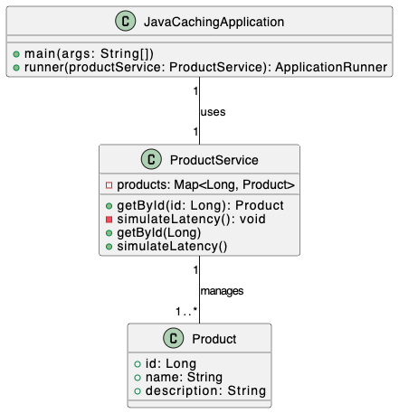
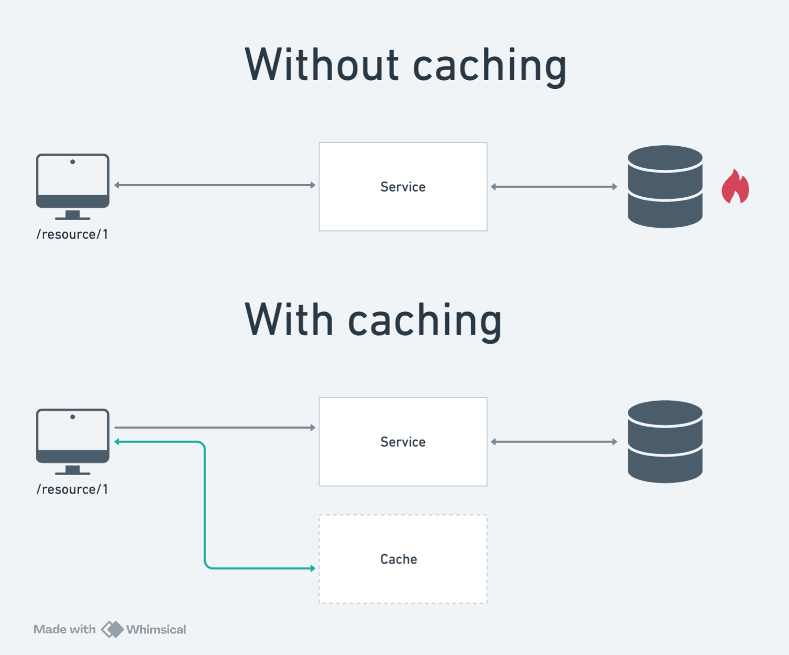

# redis-spring-boot

## Documentation Images

### Class diagram


### How caching works


## How to start the project up
```shell
cd docker && docker compose up -d & cd..
```

```shell
cd java_caching && mvn clean install
```

```shell
mvn spring-boot:run
```